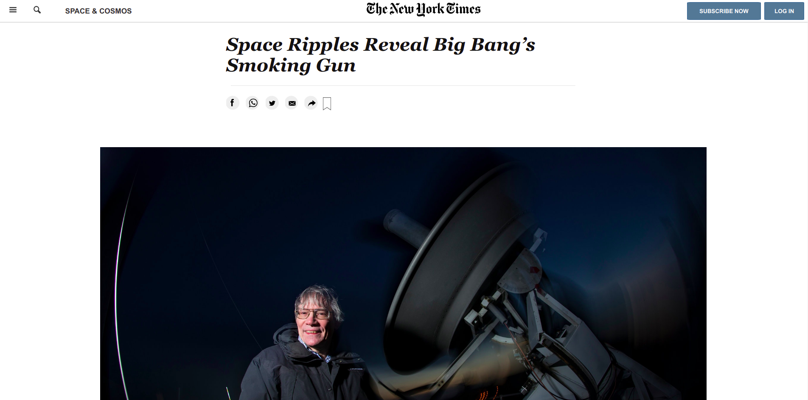

# NEW YORK TIMES ARTICLE CLONE PROJECT
This is a clone of New York Times article page. 
The real website can be visited @ https://www.nytimes.com/2014/03/18/science/space/detection-of-waves-in-space-buttresses-landmark-theory-of-big-bang.html

## Features
- I have used semantic HTML
- Flexbox and Grid
- Floats for floating image in the article aside
- SVGs for the social media icons
- A Fixed nav bar using position:fixed

## Built With

- HTML
- CSSS

## Live Demo

[Live Demo Link](https://samroodali.github.io/new-york-times-article-clone/)

## Getting Started

- Clone the project : https://github.com/SamroodAli/new-york-times-article-clone.git
- Open Index.html

## Author

👤 SAMROOD ALI

- GitHub: [@githubhandle](https://github.com/SamroodAli)
- LinkedIn: [LinkedIn](https://www.linkedin.com/in/samrood-ali/)

## 🤝 Contributing

Contributions, issues, and feature requests are welcome!

Feel free to check the [issues page](issues/).

## Show your support

Give a ⭐️ if you like this project!

## Acknowledgments

- Ilya Babcenco for his support during the project
- Lamia Hemayet Sristy for her code review. Thank you for explaining things clearly.
- New York Times article
- Microverse
